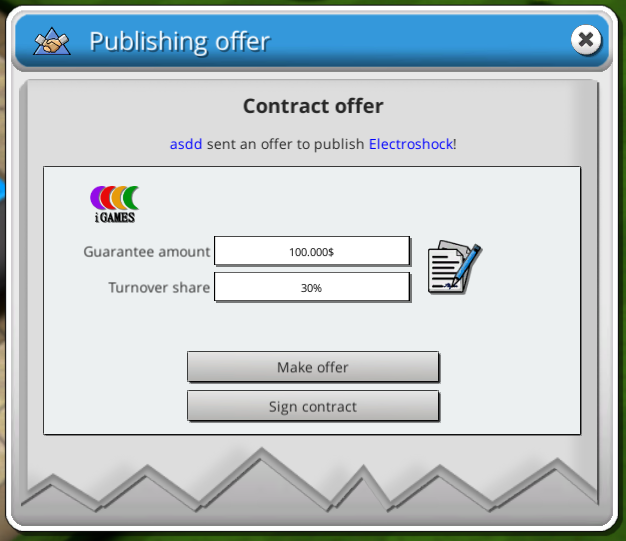
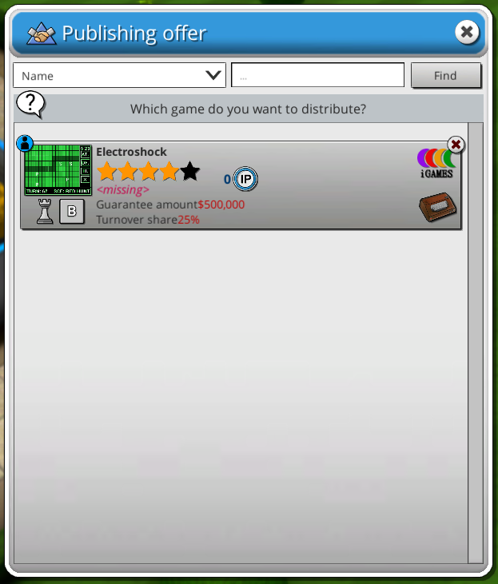
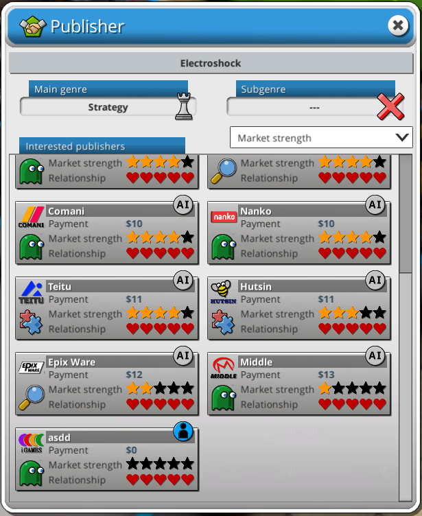

# Player Publishers

A BepInEx mod for Mad Games Tycoon 2.

## Features

- Multiplayer publisher negotiations
- Counter offers
- Negotiation menu

## Installation

IF you don't know how to install BepInEx just install PlayerPublishers.zip or PlayerPublishers-WithoutStoorvyStuff.zip and put the files into game directory.

IF you know how to install BepInEx (or you already have it) install PlayerPublishers.dll or PlayerPublishers-DLLWithStoorvyStuff.zip and put the dll in BepInEx/plugins then put other folder in main game directory.

## Notes

What is **Stoorvy Stuff**?
- I added myself as a company in the mod. If you don't want that you can just install without Stoorvy stuff versions.

If you encounter any bugs relating this mod please write a comment about it. I only tested this with 2 players but it should work with any number of players.

## Dependencies

- BepInEx 5.4.23.5
- Harmony

## Screenshots

